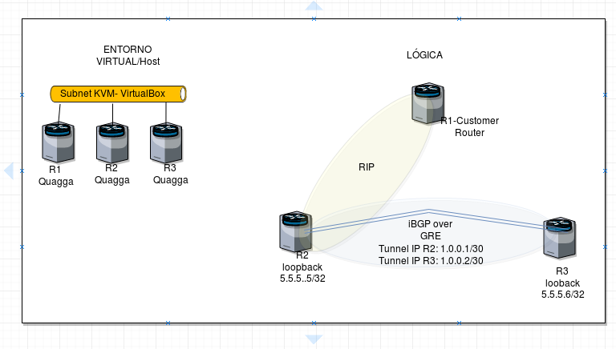

## What is it ?
Quagga is a free software routing suite that supports static and dynamic routing protocols.

The Quagga routing suite consists of 2 parts:

> zebra daemon

> routing processes (RIP,OSPF,BGP,IS-IS,Babel,OLSR,LDP,BFD)

The zebra daemon is a **abstraction layer** between the kernel and the running routing processes. Each routing protocol has its own specific daemon.

Quagga installed on a physical host acts as a dedicated router. Quagga updates the kernel routing table. It modifies interface IP addressing, sets static routes and enables dynamic routing.

## What you should do ?

The idea is to configure 3 servers that will act as routers.



-  **Step by step bro!**
    - Create Virtual Machines. 
    - Install Quagga and grant access in zebra for Rip and Bgp
    - Configure routing protocol RIP between  R1 y R2
    - Configure Loopback Address in R2 and R3
    - Configure GRE Tunnel between  R2 y R3
    - Configure eBGP or iBGP Routing Protocol between R2 y R3
    - Configure Route redistribution in Rip from R3 to R2 from BGP 

## Install and configure

#### Install linux vm
Ubuntu is recommended.
#### Grant ssh access to vm
```sh
sudo apt-get install openssh-server
```
#### Install the Quagga routing daemon:
```sh
sudo su -
password:xxxx

sudo apt-get install quagga
```
#### Enable IPv4 and IPv6 Unicast Forwarding:
```sh
echo "net.ipv4.conf.all.forwarding=1" | sudo tee -a /etc/sysctl.conf
echo "net.ipv4.conf.default.forwarding=1" | sudo tee -a /etc/sysctl.conf
sed 's/#net.ipv6.conf.all.forwarding=1/net.ipv6.conf.all.forwarding=1/g' /etc/sysctl.conf | sudo tee /etc/sysctl.conf
echo "net.ipv6.conf.default.forwarding=1" | sudo tee -a /etc/sysctl.conf
sudo sysctl -p
```
#### Create the configuration files
```sh
touch /etc/quagga/babeld.conf
touch /etc/quagga/bgpd.conf
touch /etc/quagga/isisd.conf
touch /etc/quagga/ospf6d.conf
touch /etc/quagga/ospfd.conf
touch /etc/quagga/pimd.conf
touch /etc/quagga/ripd.conf
touch /etc/quagga/ripngd.conf
touch /etc/quagga/vtysh.conf
touch /etc/quagga/zebra.conf
```

#### Change the owner and the mode of the configuration files
```sh
sudo chown quagga:quagga /etc/quagga/babeld.conf && sudo chmod 640 /etc/quagga/babeld.conf
sudo chown quagga:quagga /etc/quagga/bgpd.conf && sudo chmod 640 /etc/quagga/bgpd.conf
sudo chown quagga:quagga /etc/quagga/isisd.conf && sudo chmod 640 /etc/quagga/isisd.conf
sudo chown quagga:quagga /etc/quagga/ospf6d.conf && sudo chmod 640 /etc/quagga/ospf6d.conf
sudo chown quagga:quagga /etc/quagga/ospfd.conf && sudo chmod 640 /etc/quagga/ospfd.conf
sudo chown quagga:quagga /etc/quagga/pimd.conf && sudo chmod 640 /etc/quagga/pimd.conf
sudo chown quagga:quagga /etc/quagga/ripd.conf && sudo chmod 640 /etc/quagga/ripd.conf
sudo chown quagga:quagga /etc/quagga/ripngd.conf && sudo chmod 640 /etc/quagga/ripngd.conf
sudo chown quagga:quaggavty /etc/quagga/vtysh.conf && sudo chmod 660 /etc/quagga/vtysh.conf
sudo chown quagga:quagga /etc/quagga/zebra.conf && sudo chmod 640 /etc/quagga/zebra.conf

sudo nano /etc/quagga/daemons
zebra=yes
bgpd=yes
ospfd=yes
ospf6d=yes
ripd=yes
ripngd=yes
isisd=yes
babeld=yes

sudo nano /etc/quagga/debian.conf
vtysh_enable=yes
zebra_options=" --daemon -A 127.0.0.1 -P 2601 -u quagga -g quagga"
bgpd_options=" --daemon -A 127.0.0.1 -P 2605 -u quagga -g quagga --retain -p 179"
ospfd_options=" --daemon -A 127.0.0.1 -P 2604 -u quagga -g quagga"
ospf6d_options=" --daemon -A ::1 -P 2606 -u quagga -g quagga"
ripd_options=" --daemon -A 127.0.0.1 -P 2602 -u quagga -g quagga"
ripngd_options=" --daemon -A ::1 -P 2603 -u quagga -g quagga"
isisd_options=" --daemon -A 127.0.0.1 -P 2608 -u quagga -g quagga"
babeld_options=" --daemon -A 127.0.0.1 -P 2609 -u quagga -g quagga"
```

#### Restart the daemon
```sh
sudo /etc/init.d/quagga restart || sudo systemctl restart zebra
```


#### CONFIG VSTYSH
```sh
echo VTYSH_PAGER=more > /etc/environment
```

## R1
#### RIP
```
router rip
 timers basic 5 30 20
 network eth0
```
## R2
#### quagga
```
!
router rip
 timers basic 5 30 20
 redistribute bgp metric 5
 netowrk eth0
!
router bgp 65101
 no synchronization
 bgp router-id 1.0.0.1
 redistribute kernel metric 100
 redistribute connected metric 100
 redistribute static metric 100
 redistribute rip metric 100
 neighbor fd77:d15:128::ffff:141:2 remote-as 65102
 neighbor fd77:d15:128::ffff:141:2 soft-reconfiguration inbound
 neighbor fd77:d15:128::ffff:141:2 route-map engw-in in
 neighbor fd77:d15:128::ffff:141:2 route-map engw-out out
 no auto-summary
!

!
 address-family ipv6
 neighbor fd77:d15:128::ffff:141:2 activate
 exit-address-family
!
```

> **Pro tip: ** The BGP neighbor is IPV6, session IPV6 and IPV4 prefix.. but everything can be done in IPV4.

```
!
route-map engw-in permit 5
 match ip address prefix-list prefixes-in-v4-engw
!
route-map engw-out permit 5
 match ip address prefix-list prefixes-out-v4-engw
!

ip prefix-list prefixes-in-v4-engw seq 5 permit any
ip prefix-list prefixes-out-v4-engw seq 5 permit any
```

#### interfaces
```
root@Ubuntu3:~# cat /etc/network/interfaces
# This file describes the network interfaces available on your system
# and how to activate them. For more information, see interfaces(5).

# The loopback network interface
auto lo
iface lo inet loopback
up ip addr add 5.5.5.5/32 dev lo

# The primary network interface
auto eth0
iface eth0 inet static
address 192.168.122.6
netmask 255.255.255.0
gateway 192.168.122.1

##Tunnel
up ip tunnel add t01 mode gre remote 192.168.122.5 local 192.168.122.6 ttl 255
up ip addr add 1.0.0.1/30 dev t01
up ip -6 addr add fd77:d15:128::ffff:141:1/126 dev t01
up ip link set mtu 1464 multicast on dev t01
up ip link set up t01
```