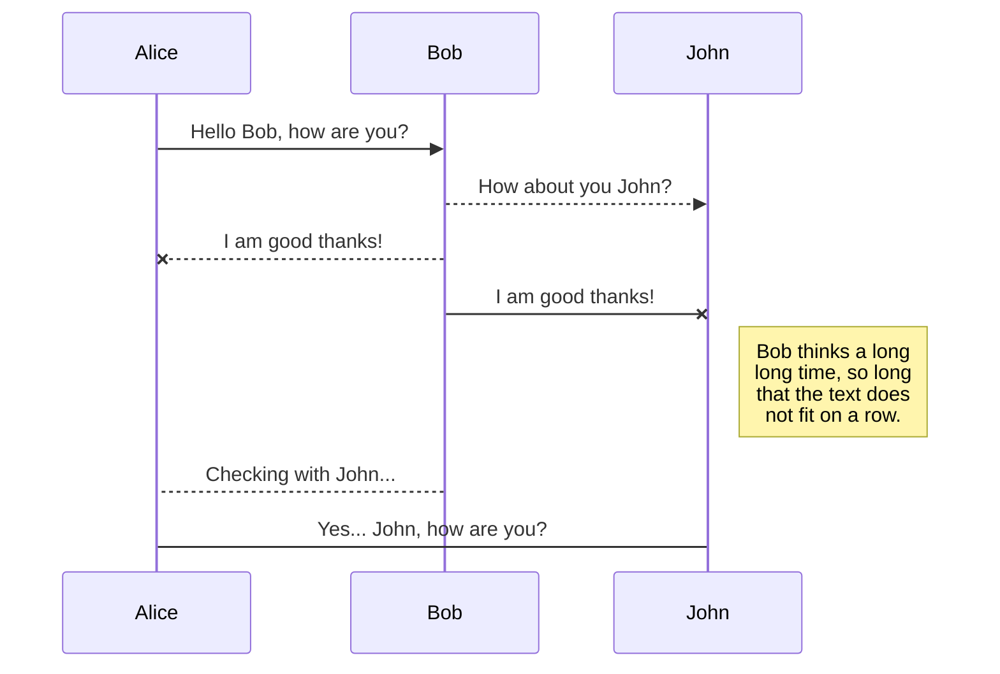

## What is it ?
Quagga is a free software routing suite that supports static and dynamic routing protocols.

The Quagga routing suite consists of 2 parts:

> zebra daemon

> routing processes (RIP,OSPF,BGP,IS-IS,Babel,OLSR,LDP,BFD)

The zebra daemon is a **abstraction layer** between the kernel and the running routing processes. Each routing protocol has its own specific daemon.

Quagga installed on a physical host acts as a dedicated router. Quagga updates the kernel routing table. It modifies interface IP addressing, sets static routes and enables dynamic routing.

## Installation

